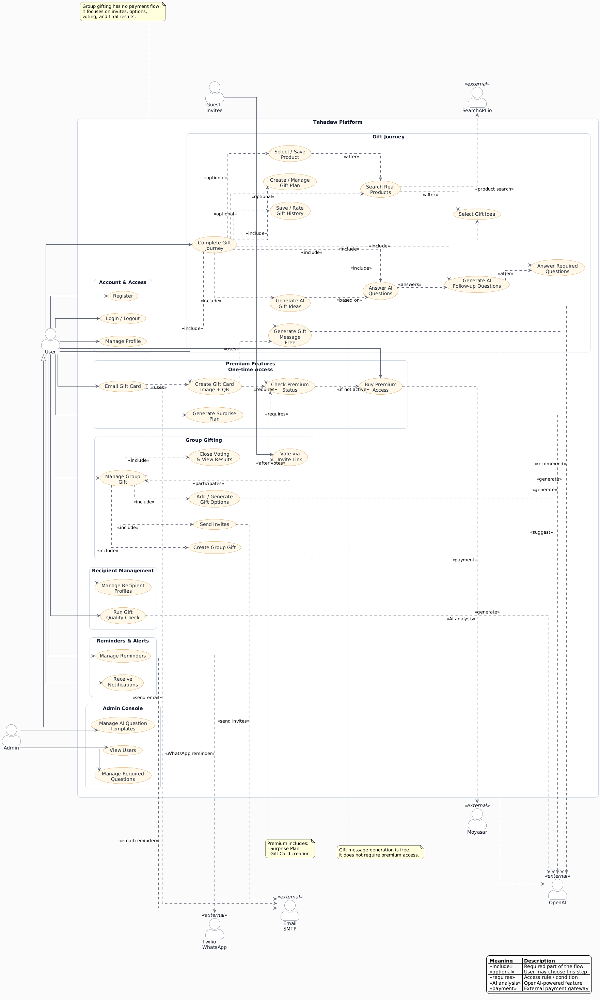

# Tahadaw — Intelligent Gift Planning & Gift Card Platform

**Tahadaw** is a Spring Boot backend that helps people plan the perfect gift. It builds rich recipient
profiles, asks smart required and AI-generated follow-up questions, recommends gift ideas, searches real
products, generates heartfelt gift messages and premium gift cards (with QR codes), runs group-gift
voting, tracks gift history, and sends reminders — all powered by OpenAI and a Moyasar payment flow for
premium features.

> **نبذة بالعربية**
> تهادوا هو نظام مبني على Spring Boot يساعد المستخدم على تخطيط الهدية المثالية.
ينشئ ملفًا تعريفيًا غنيًا عن المستلم، ويطرح أسئلة إلزامية وأسئلة ذكية مولّدة بالذكاء الاصطناعي،
ثم يقترح أفكار هدايا مناسبة، ويبحث عن منتجات حقيقية، ويولّد رسائل تهنئة وبطاقات هدايا مميّزة مع رمز QR،
ويدير التصويت على الهدايا الجماعية، ويتتبّع سجل الهدايا، ويرسل التذكيرات — مدعومًا بالذكاء الاصطناعي
من OpenAI ونظام دفع Moyasar للميزات المدفوعة (Premium).
---

## Live API (AWS)

```
http://tahadaw-alb-278802991.eu-central-1.elb.amazonaws.com/api/v1
```

---

## Table of Contents

- [Overview](#overview)
- [Tech Stack](#tech-stack)
- [External Integrations](#external-integrations)
- [Prerequisites](#prerequisites)
- [Getting Started](#getting-started)
- [Configuration](#configuration)
- [Project Structure](#project-structure)
- [UI Design (Figma)](#ui-design-figma)
- [System / Use Case Diagram](#system--use-case-diagram)
- [Entity Relationship Diagram](#entity-relationship-diagram)
- [Team Contributions](#team-contributions)
- [API Base URL](#api-base-url)
- [Postman API Documentation](#postman-api-documentation)

---

## Overview

Tahadaw uses HTTP Basic authentication; the signed-in user comes from the Spring Security principal.

| Role | Description |
|------|-------------|
| **User** | Manages recipients and gift plans, answers questions, gets AI recommendations, searches products, generates messages and gift cards, runs group gifts, tracks history, and sets reminders |
| **Admin** | Manages the required-question catalog and raw AI question/answer tooling |

Main feature areas:

- **Gift Journey** — recipient profiles → gift plan → required & AI questions → AI gift ideas → real product search → selection → gift message.
- **Premium Features** — premium gift cards (image + QR), surprise plans, unlocked via a Moyasar one-time payment.
- **Group Gifting** — create a group gift, add/AI-generate options, send invites, public token-based voting, results.
- **Engagement** — gift history & spending insights, reminders (email / WhatsApp / in-app), notifications, and an aggregated dashboard.

---

## Tech Stack

| Layer | Technology |
|-------|------------|
| Language | Java 17 |
| Framework | Spring Boot 4.1.0 |
| Web | Spring MVC + Spring WebFlux (`RestClient`) |
| Security | Spring Security (HTTP Basic auth, BCrypt) |
| Persistence | Spring Data JPA / Hibernate |
| Database | MySQL (`mysql-connector-j`) |
| Validation | Jakarta Bean Validation |
| Object Mapping | ModelMapper |
| JSON | Jackson |
| Email | Spring Mail (SMTP) |
| PDF | OpenPDF (LibrePDF) |
| QR Codes | Google ZXing (`core` + `javase`) |
| Scheduling | Spring `@Scheduled` (reminder jobs) |
| Boilerplate | Lombok |
| Build | Maven (`mvnw` wrapper) |
| Containerization | Docker |
| Deployment / Cloud | AWS |
| Testing | Spring Boot Test, Spring Security Test, JPA Test |

---

## External Integrations

| Integration | Purpose |
|-------------|---------|
| **OpenAI** (`gpt-4o-mini`) | Required/AI follow-up questions, gift idea recommendations, gift messages, surprise plans, group-gift options, gift quality checks |
| **Moyasar** | Premium one-time payment gateway (sandbox) with 3‑D Secure browser callback + webhook |
| **SearchAPI.io** | Real product search (Google Shopping) for selected gift ideas |
| **Twilio** | WhatsApp reminder notifications |
| **SMTP Email** | Gift card delivery, payment receipts, group-gift invites |

---

## Prerequisites

- **Java 17+**
- **Maven 3.9+** (or use the included `./mvnw` wrapper)
- **MySQL 8+** with a database named `tahadaw`
- Optional but recommended for full functionality:
  - OpenAI API key
  - Moyasar (test) secret key
  - SearchAPI.io key
  - SMTP credentials (Gmail App Password or similar)
  - Twilio credentials (WhatsApp)

---

## Getting Started

### 1. Clone the repository

```bash
git clone <repository-url>
cd Tahadaw
```

### 2. Create the database

```sql
CREATE DATABASE tahadaw;
```

### 3. Configure local secrets

Create `src/main/resources/application-local.properties` (gitignored) and fill in your values:

```properties
spring.datasource.password=your_mysql_password
openai.api.key=sk-your-key-here
searchapi.api.key=your-searchapi-key
moyasar.api-key=your-moyasar-test-key
```

See [Configuration](#configuration) for the full list of optional settings.

### 4. Run the application

```bash
./mvnw spring-boot:run
```

On Windows:

```bash
mvnw.cmd spring-boot:run
```

The API starts on **http://localhost:8080** by default.

### 5. Verify

```bash
curl -u <username>:<password> http://localhost:8080/api/v1/recipients/get
```

---

## Configuration

| Property | Description | Required |
|----------|-------------|----------|
| `spring.datasource.password` | MySQL password | Yes |
| `openai.api.key` | OpenAI API key for AI features | Yes (for AI endpoints) |
| `ai.model` | OpenAI model (default: `gpt-4o-mini`) | No |
| `searchapi.api.key` | SearchAPI.io key for product search | For product search |
| `moyasar.api-key` | Moyasar secret key (sandbox) | For premium payments |
| `moyasar.callback-url` | 3‑D Secure browser redirect target | No (has default) |
| `premium.amount-minor` / `premium.currency` | Premium price (default `9900` / `SAR`) | No |
| `spring.mail.*` | SMTP settings for email notifications | For email features |
| `twilio.account-sid` / `twilio.auth-token` / `twilio.from` | WhatsApp notifications | For WhatsApp features |
| `spring.jpa.hibernate.ddl-auto` | Schema mode (default: `create-drop`) | No |

Non-secret defaults live in `src/main/resources/application.properties`. Secrets belong in
`application-local.properties` (gitignored).

---

## Project Structure

```
src/main/java/org/example/tahadaw/
├── AI/              # OpenAI integration (AiService, parsers)
├── Api/             # Shared API types (ApiResponse, ApiException)
├── Config/          # Spring Security configuration
├── Controller/      # REST endpoints
├── DTO/IN           # Request bodies
├── DTO/OUT          # Response bodies
├── Model/           # JPA entities
├── Repository/      # Spring Data repositories
└── Service/         # Business logic + integrations (Moyasar, Twilio, SearchAPI, Email, QR, PDF)

docs/images/         # Architecture & ER diagram assets
postman/             # Full-system Postman collection (flows grouped by developer)
```

---

## UI Design (Figma)

Interactive UI mockups for the Tahadaw platform (Arabic RTL dashboard and user flows):

**[Tahadaw UI — Figma (تهادوا)](https://www.figma.com/design/1kn0xnKDmQyf60eT7sz27N/%D8%AA%D9%87%D8%A7%D8%AF%D9%88%D8%A7?node-id=0-1&t=PU0KDFWhmlcEtHAu-1)**

---

## System / Use Case Diagram



---

## Entity Relationship Diagram


---
## Team Contributions
## Bayan Saleh Contributions

The following **34 API paths** make up Bayan Saleh's flows:

```text
Flow 1  — Users
Flow 2  — Recipients
Flow 4  — Admin Required Questions
Flow 10 — Gift Quality Check
Flow 14 — Group Gifts & Voting
Flow 15 — Reminders
```

### Endpoint count

| Type | Count |
|------|------:|
| CRUD / Basic endpoints | 22 |
| Extra feature endpoints | 12 |
| **Total API paths** | **34** |

> The reminder scheduler and WhatsApp sending job are background features. They are part of the Reminders flow, but they are not counted as API paths because they run automatically with `@Scheduled`.

---

## Endpoints Summary

### Flow 1 — Users

| Method | Endpoint | Description |
|--------|----------|-------------|
| `POST` | `/api/v1/users/register` | Register a new user |
| `GET` | `/api/v1/users/get` | List users |
| `PUT` | `/api/v1/users/update` | Update user profile |
| `DELETE` | `/api/v1/users/delete` | Delete user account |

### Flow 2 — Recipients

| Method | Endpoint | Description |
|--------|----------|-------------|
| `POST` | `/api/v1/recipients/add/{userId}` | Add a recipient for a user |
| `GET` | `/api/v1/recipients/get` | List all recipients |
| `GET` | `/api/v1/recipients/get-by-user-id/{userId}` | List recipients for a specific user |
| `GET` | `/api/v1/recipients/get/{userId}/{recipientId}` | Get one recipient owned by a user |
| `PUT` | `/api/v1/recipients/update/{userId}/{recipientId}` | Update a recipient |
| `DELETE` | `/api/v1/recipients/delete/{userId}/{recipientId}` | Delete a recipient |

### Flow 4 — Admin Required Questions

| Method | Endpoint | Description |
|--------|----------|-------------|
| `POST` | `/api/v1/required-questions/add` | Add a required question |
| `GET` | `/api/v1/required-questions/get` | List required questions |
| `PUT` | `/api/v1/required-questions/update/{questionId}` | Update a required question |
| `DELETE` | `/api/v1/required-questions/delete/{questionId}` | Delete a required question |
| `PUT` | `/api/v1/required-questions/disable/{questionId}` | Disable a required question without deleting it |

### Flow 10 — Gift Quality Check

| Method | Endpoint | Description |
|--------|----------|-------------|
| `POST` | `/api/v1/gift-quality-checks/add/{userId}/{recipientId}` | Run an AI gift quality check |
| `GET` | `/api/v1/gift-quality-checks/recipients/{recipientId}` | List quality checks for a recipient |
| `GET` | `/api/v1/gift-quality-checks/get-one/{checkId}` | Get one quality check result |

### Flow 15 — Reminders

| Method | Endpoint | Description |
|--------|----------|-------------|
| `POST` | `/api/v1/reminders/add/{userId}/{recipientId}` | Create a reminder |
| `GET` | `/api/v1/reminders/get` | List all reminders |
| `GET` | `/api/v1/reminders/get-my/{userId}` | List reminders for one user |
| `PUT` | `/api/v1/reminders/update/{reminderId}` | Update a reminder |
| `DELETE` | `/api/v1/reminders/delete/{reminderId}` | Delete a reminder |

**Extra background behavior:** the reminder service uses `@Scheduled` to check due reminders and send WhatsApp notifications through Twilio.

### Flow 14 — Group Gifts & Voting

| Method | Endpoint | Description |
|--------|----------|-------------|
| `POST` | `/api/v1/group-gifts?userId=` | Create a group gift poll |
| `GET` | `/api/v1/group-gifts/my?userId=` | List my group gifts |
| `GET` | `/api/v1/group-gifts/{groupGiftId}?userId=` | Get one group gift |
| `POST` | `/api/v1/group-gifts/{groupGiftId}/options?userId=` | Add a manual gift option |
| `POST` | `/api/v1/group-gifts/{groupGiftId}/options/generate-ai?userId=` | Generate gift options using AI |
| `GET` | `/api/v1/group-gifts/{groupGiftId}/options` | List gift options for a group gift |
| `POST` | `/api/v1/group-gifts/{groupGiftId}/invites?userId=` | Send voting invites by email |
| `PUT` | `/api/v1/group-gifts/{groupGiftId}/close-voting?userId=` | Close voting and store the winning option |
| `GET` | `/api/v1/group-gifts/{groupGiftId}/results?userId=` | View vote results |
| `GET` | `/api/v1/public/group-gifts/vote/{token}` | Public vote page data by invite token |
| `POST` | `/api/v1/public/group-gifts/vote/{token}` | Submit a vote by invite token |


**Extra notification behavior:** when voting invites are created, the system generates a unique invite token and sends an email notification to each invitee using Spring Mail, informing them that they have been invited to vote on the group gift.

---

## Example Requests

### Register user

```http
POST /api/v1/users/register
Content-Type: application/json

{
  "username": "bayan_user",
  "password": "Secure!2026pass",
  "fullName": "Bayan Saleh",
  "email": "bayan@example.com",
  "phoneNumber": "0500000000"
}
```

### Add recipient

```http
POST /api/v1/recipients/add/1
Content-Type: application/json

{
  "name": "سارة",
  "relationship": "أخت",
  "age": 22,
  "gender": "أنثى",
  "interests": "القراءة، القهوة، السفر",
  "hobbies": "التصوير والكتابة",
  "favoriteColors": "الوردي، الأبيض",
  "favoriteBrands": "أبل، سيفورا",
  "dislikes": "العطور القوية",
  "personalityStyle": "هادئة وتحب التفاصيل",
  "sizeInfo": "M",
  "notes": "تستعد لحفل تخرجها"
}
```

### Run AI gift quality check

```http
POST /api/v1/gift-quality-checks/add/1/1
Content-Type: application/json

{
  "giftName": "عطر عودي",
  "giftDescription": "عطر عود شرقي مناسب للمناسبات المسائية",
  "price": 499,
  "occasionType": "عيد ميلاد"
}
```

### Get gift quality check result

```http
GET /api/v1/gift-quality-checks/{{qualityCheckId}}
```

```json
{
  "giftName": "عطر عودي",
  "giftDescription": "عطر عود شرقي مناسب للمناسبات المسائية",
  "price": 499.0,
  "occasionType": "عيد ميلاد",
  "suitability": "محايد",
  "strengths": "الهدية مرتبطة باهتمامات سارة لأنها تحب العطور، كما أن العطر العودي يناسب الطابع الشرقي وقد يكون أنيقًا ومناسبًا لمناسبة عيد ميلاد، خصوصًا مع شخصيتها الكلاسيكية وعلاقتك القريبة بها كأخت.",
  "weaknesses": "سارة لا تحب العطور القوية، وعطور العود غالبًا تكون ثقيلة وواضحة، لذلك قد لا تناسب ذوقها أو قد تستخدمها نادرًا فقط. كذلك لا يوجد سجل هدايا سابق يوضح هل تفضل هذا النوع من العطور أم لا.",
  "aiAdvice": "إذا كنت متأكدًا أن هذا العطر العودي ناعم وغير قوي فقد يكون اختيارًا جيدًا، لكن أنصحك باختيار عطر أنعم وكلاسيكي، أو إضافة بطاقة من زارا أو سيفورا حتى تتمكن سارة من اختيار ما يناسبها إذا لم يناسبها العطر."
}
```

### Get AI-generated group-gift options

```http
GET /api/v1/group-gifts/get-options/{{groupGiftId}}
```

```json
[
  {
    "id": 1,
    "giftName": "طقم عطر ناعم من سيفورا",
    "description": "مجموعة عطرية خفيفة وراقية تشمل عطرًا ناعمًا مع لوشن أو رذاذ للجسم، وتأتي عادة بتغليف أنيق هدية.",
    "priceBand": "٢٥٠ - ٣٥٠ ريال",
    "reason": "يتناسب اهتمام سارة بالعطور مع مراعاة أنها لا تفضل الروائح القوية، كما أن سيفورا من علامات محببة لها."
  },
  {
    "id": 2,
    "giftName": "مجموعة أدوات رسم فاخرة",
    "description": "حقيبة متكاملة تحتوي على ألوان مائية أو أكريليك، فرش عالية الجودة، ودفتر رسم، وتغلف بطريقة أنيقة تناسب هواية الرسم وأسلوب سارة الكلاسيكي.",
    "priceBand": "٢٠٠ - ٣٠٠ ريال",
    "reason": "اختيار عملي ومميز لهواية الرسم ويشجعها على تطوير جانبها الفني بطريقة تناسب شخصيتها الكلاسيكية."
  },
  {
    "id": 3,
    "giftName": "قارئ إلكتروني للكتب",
    "description": "جهاز خفيف لقراءة الكتب الإلكترونية مع شاشة مريحة للعين وسعة مناسبة لحفظ مكتبة صغيرة متنوعة.",
    "priceBand": "٤٥٠ - ٦٥٠ ريال",
    "reason": "هدية مناسبة لمحبة القراءة وتمنحها تجربة مريحة ومنظمة للاستمتاع بالكتب في أي وقت."
  }
]
```


### Send group-gift invites

```http
POST /api/v1/group-gifts/send-invite/{{groupGiftId}}
Content-Type: application/json

[
  {
    "inviteeName": "شهد",
    "inviteeEmail": "sho.chi.09@gmail.com"
  }
]
```

```json
[
  {
    "id": 1,
    "inviteeName": "شهد",
    "inviteeEmail": "sho.chi.09@gmail.com",
    "token": "66ffa12de4ea4a37b3d5555ea9883d87",
    "status": "PENDING"
  }
]
```


### Submit public vote

```http
POST /api/v1/public/group-gifts/vote/{token}
Content-Type: application/json

{
  "optionId": 1
}
```


## API Base URL

```
http://localhost:8080/api/v1
```

All endpoints return JSON. Successful mutations typically respond with an `ApiResponse` message or the
created/updated DTO. Authentication is HTTP Basic; the user is taken from the Spring Security principal.

Errors are returned with HTTP 4xx/5xx and a message body (`spring.web.error.include-message=always`).

---

## Postman API Documentation

**[Tahadaw — Full System Flows (Postman API Docs)](https://documenter.getpostman.com/view/54223024/2sBXwwooJF)**

**Import the collection locally:**

| Resource | Location |
|----------|----------|
| Collection JSON | [`postman/Tahadaw-Full-System-Flows.postman_collection.json`](postman/Tahadaw-Full-System-Flows.postman_collection.json) |
| Regenerate script | [`postman/build-collection.js`](postman/build-collection.js) |

The collection includes end-to-end flows grouped by developer (Bayan, Shahad, Saud) plus an **Extra**
folder for out-of-flow endpoints (dashboard, spending stats, recipient insights, gift card PDF download).

---

## License

Capstone project — see repository for license details.
